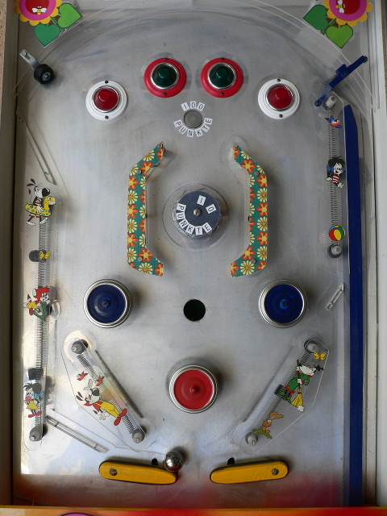

# flipper-walter

This ongoing project is about restoring and modernizing a pin-ball
machine designed and constructed in the early 70s by my father, Walter
Reuter (sen).

Fig. 1: Pin-Ball Playing Field

## Roadmap

In the course of restoring and modernizing the pin-ball machine, I am
planning a series of milestones.

### Milestone 1: Documentation of Status Quo (DONE)
I have documented the status quo of the pin-ball machine with a series
of photos, including inside details.  Since GitHub is more about
source code than photos, I have uploaded the photos
[elsewhere](https://photos.app.goo.gl/bx4RdFARAU32SBQK6).

### Milestone 2: Reverse Engineering (DONE)
Also, I have already reverse engineered the complete automaton of the
pin-ball machine, resulting in schematic diagrams in the [schematics
directory](schematics).

### Milestone 3: Make It Run Again (TODO)
Basically, the pin-ball machine still works fine, but some minor
details need overhaul to re-animate it.  Besides some general
cleaning, in particular, most of the rubber bands have become brittle
over time and need to be replaced.

### Milestone 4: Make It Safe (TODO)
While the pin-ball machine was technically fully ok regarding the
standards as of the early 70s, it does not at all comply with today's
regulations.  As such, the machine can currently be legally operated
only in a safe environment such as a laboratory.  Specifically, it
does not confirm to current electromagnetic radiation regulations.
Also, it does not comply with some of the current VDE regulations such
as those referring to the separation of 230V primary net voltage and
secondary circuits.  Finally, reduction of power dissipation would be
nice and also contribute to reduced electromagnetic radiation.

### Milestone 5: Pimp It Up! (TODO)
The goal of this step is to modernize the pin-ball machine.
Specifically,

* replace old filament light bulbs and neon tubes with energy-saving
  LED lamps,

* replace game logic that is currently implemented with relays with
  programmable and thus flexible microcontroller design.

However, the overall “mechanical feeling” of the machine should
survive as much as possible.  Specifically, the old relay technology
with its audible clicks significantly contributes this feeling and
sentiment, as well as the warm light spectrum of the old filament
light bulbs.

_Note:_ Milestones 4 and 5 may turn out to be closely related.  For
example, some of the relays need to be replaced by solid state
circuits for both reasons, reducing electromagnetic radiation, as well
as making the game control logic programmable and thus more flexible.
Similarly, replacing light bulbs with RGB LEDs with a programming
interface such as WS2812 both helps reducing power dissipation, as
well as enables flexible programming of colors.
